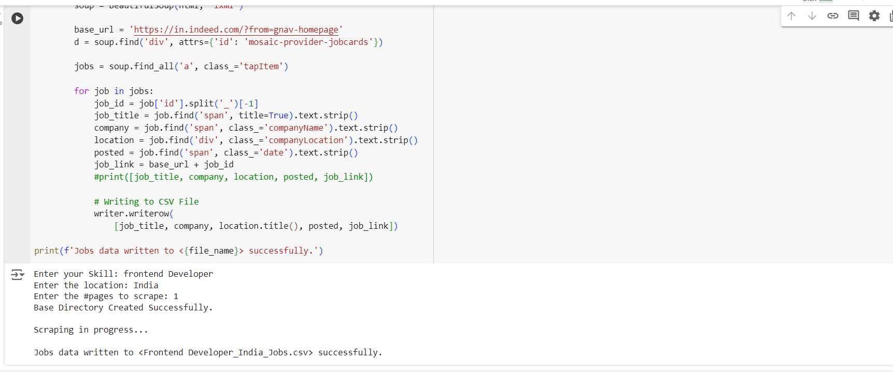

# Job Listings Scraper

Job Listings Scraper is a Python-based web scraping tool that extracts job listings from Indeed based on user-provided skills and location. The script collects data such as job title, company, location, posting date, and the application link, and saves it into a CSV file for easy analysis and reference.

## Features

- Scrapes job listings from Indeed based on specified skills and location.
- Extracts relevant details about each job.
- Saves the data into a CSV file for easy reference.

## Screenshots

### Script Output


## Installation

1. Clone the repository:

    ```bash
    git clone https://github.com/your-username/job-listings-scraper.git
    cd job-listings-scraper
    ```

2. Create a virtual environment and activate it:

    ```bash
    python -m venv venv
    source venv/bin/activate  # On Windows use `venv\Scripts\activate`
    ```

3. Install the required packages:

    ```bash
    pip install -r requirements.txt
    ```

4. Run the script:

    ```bash
    python scraper.py
    ```

## Usage

1. When prompted, enter the skill you're looking for.
2. Enter the location for the job search.
3. Enter the number of pages you want to scrape.
4. The script will fetch the job listings, extract the required details, and save them into a CSV file named `{Skill}_{Location}_Jobs.csv`.

## Code Explanation

The script performs the following steps:

1. **Fetch the webpage**: The script sends a request to Indeed with the specified skill and location and fetches the HTML content.
2. **Parse HTML**: It uses BeautifulSoup to parse the HTML content.
3. **Extract Data**: The script finds all job listings and extracts details such as job title, company, location, posting date, and application link.
4. **Save Data**: The extracted data is saved into a CSV file using the `csv` module.

## Requirements

- `requests`
- `beautifulsoup4`

You can install the required packages using:

```bash
pip install requests beautifulsoup4

